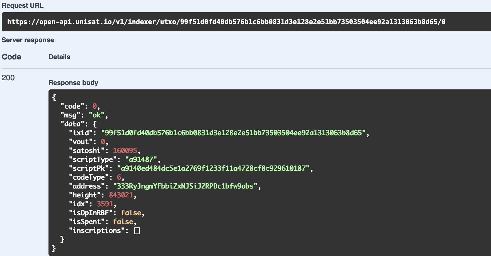

### Notes

The return result of this UTXO interface will have three scenarios:

1. When UTXO has not been spent, it will return the information of this UTXO, and isSpent will be set to false.

   

2. When UTXO has been spent, but the transaction that spent it has not yet been confirmed, it will return the information of this UTXO, and isSpent will be set to true.

   

3. When UTXO has been spent and the transacted spend has been confirmed, it will return null.
   

#### This endpoint was updated on 2025-05-20

BRC20 inscriptions of type TRANSFER (those that have undergone transfers) and MINT inscriptions, which no longer hold value, will no longer be available for query after this update.
**Before Upgrade:**

```JSON
{
  "code": 0,
  "msg": "ok",
  "data": {
    "txid": "...",
    "vout": 0,
    "satoshi": 546,
    "scriptType": "5120",
    "scriptPk": "...",
    "codeType": 9,
    "address": "...",
    "height": 815539,
    "idx": 2516,
    "isOpInRBF": false,
    "isSpent": false,
    "inscriptionsCount": 2,
    "inscriptions": [
      {
        "inscriptionNumber": 38012882,
        "inscriptionId": "...",
        "offset": 0,
        "moved": false,
        "sequence": 0,
        "isCursed": false,
        "isVindicate": false,
        "isBRC20Ext": false,
        "isBRC20": true
      },
      {
        "inscriptionNumber": 38012883,
        "inscriptionId": "....",
        "offset": 0,
        "moved": false,
        "sequence": 0,
        "isCursed": false,
        "isVindicate": false,
        "isBRC20Ext": false,
        "isBRC20": false
      }
    ]
  }
}
```

**After Upgrade:**

```JSON
{
  "code": 0,
  "msg": "ok",
  "data": {
    "txid": "...",
    "vout": 0,
    "satoshi": 546,
    "scriptType": "5120",
    "scriptPk": "...",
    "codeType": 9,
    "address": "...",
    "height": 815539,
    "idx": 2516,
    "isOpInRBF": false,
    "isSpent": false,
    "inscriptionsCount": 2,
    "inscriptions": [
    {
        "inscriptionNumber": 38012883,
        "inscriptionId": "....",
        "offset": 0,
        "moved": false,
        "sequence": 0,
        "isCursed": false,
        "isVindicate": false,
        "isBRC20Ext": false,
        "isBRC20": false
      }
     ]
  }
}
```

Migration Guidance:

- The inscriptionsCount (no changes required)
- The inscriptions array will eventually be removed for useless brc20 Inscriptions
