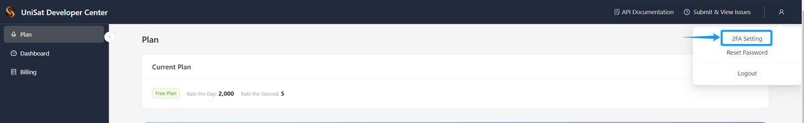
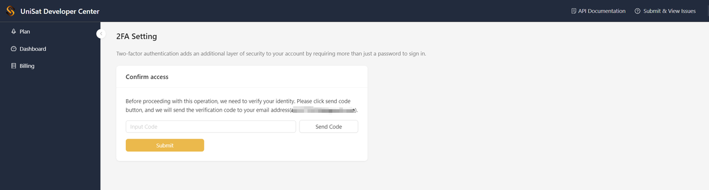
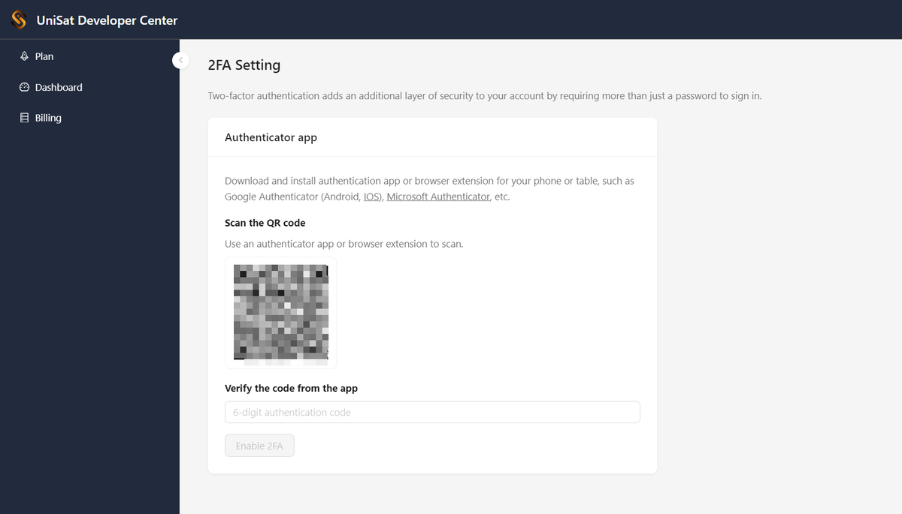
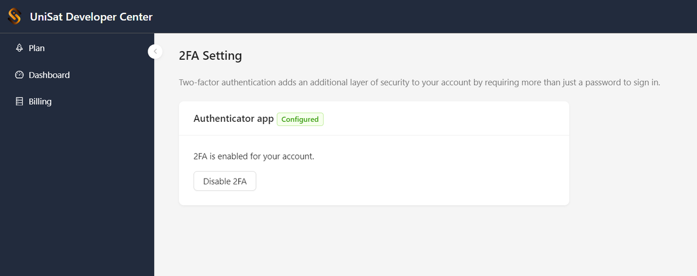

# Enable the Two-Factor Authentication

Two-factor authentication (2FA) is an additional security feature that requires users to enter a six-digit verification code when logging into their accounts. This greatly enhances account security and effectively prevents unauthorized access.

For the safety of your account, we recommend setting up two-factor authentication immediately after registering to provide an extra layer of protection.

## How to Link Two-Factor Authentication

### 1. Open 2FA Settings

Enter UniSat [Developer Center](https://developer.unisat.io/dashboard), click on the avatar on the right side of the page, and select `2FA Setting` from the dropdown menu.

### 2. Confirm Your Email

Before binding 2FA, you need to confirm your email to ensure the operation is authorized by you. Click `Send Code` on the page, input the verification code received in your email, and click `Submit` to enter the 2FA binding page.

### 3. Install an Authentication App

Follow the instructions on the page to first download and install an authentication app.

- iOS: Search Google Authenticator in the App Store.
- Android: Search Google Authenticator in Google Play or use [this download link](https://play.google.com/store/apps/details?id=com.google.android.apps.authenticator2).

Then, use the authenticator app to scan the QR code on the page and enter the six-digit verification code in the authentication app.

### 4. Complete 2FA Setup

Now you are done with 2FA. You can also disable 2FA if needed.

