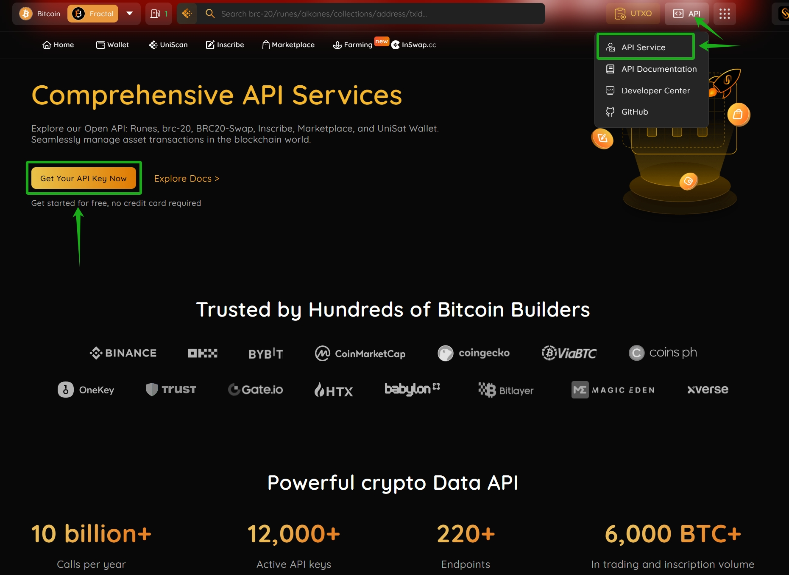
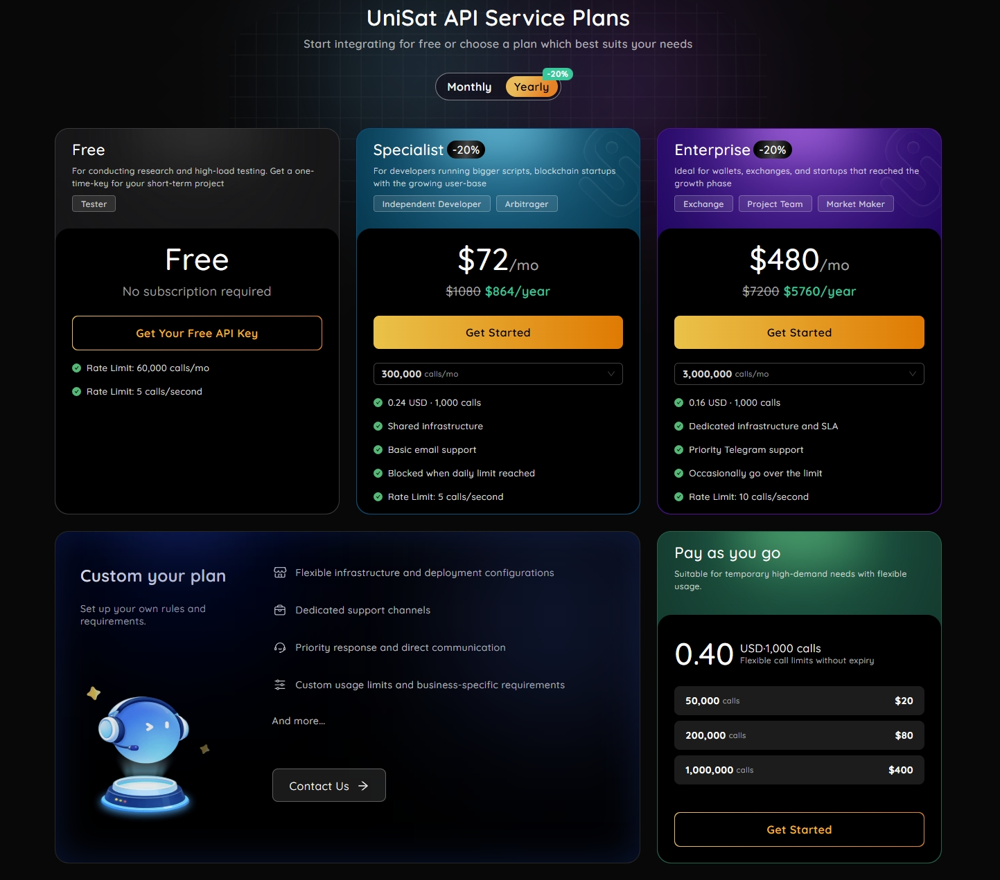
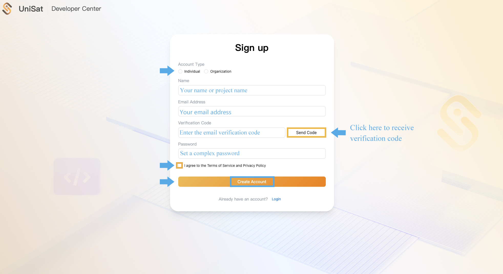
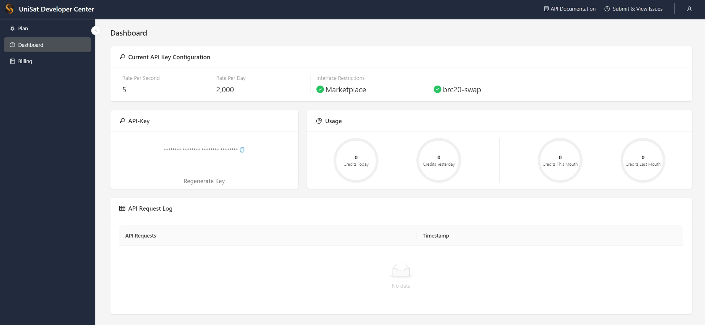
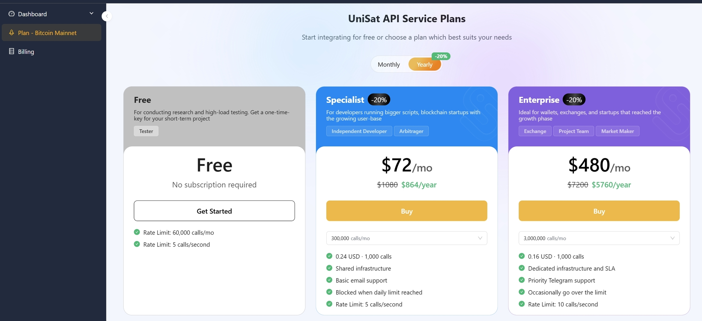
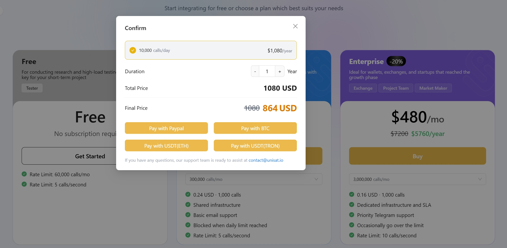
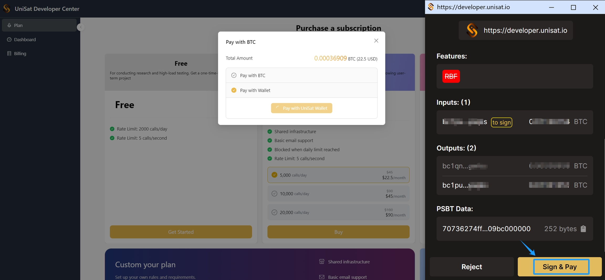
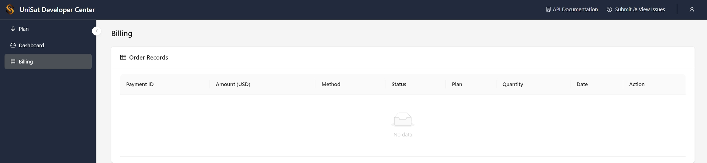

# How to Acquire a UniSat API Key

Previously, API keys were requested by contacting the UniSat team and applying via email. With the new Developer Center, you will need to register with your email and choose the appropriate plan.

Here are the steps to acquire a UniSat API Key:

## 1. Visit the UniSat API Service Page

Visit the UniSat website and click `API` in the homepage navigation bar. From the dropdown menu, select `API Service` to access the detailed API plans page. Alternatively, you can directly click here to view the API plans.

## 2. Choose a Plan

Choose the plan that suits your needs and click `Get Started` under the detailed description of the plan to go to the Developer Center plan acquire page. Or you can click `Developer Center` in the yellow box on the page to enter the Developer Center.

Enjoy 20% off when you choose an annual Specialist or Enterprise plan.

## 3. Register a Developer Center Account

Before acquiring a plan, you need to register a Developer Center account using your email.

## 4. View the Dashboard

Once registered, go to the Dashboard page where you will see your API Key, Current API Key Configuration, and your API Request Log. Newly registered accounts receive a free access quota of 5 calls per second and up to 2,000 calls per day on Bitcoin.

## 5. Open the Plan Page

Click `Plan` in the upper left corner to go to the API Key acquire page.

## 6. Buy a Plan

Choose the plan you need and click the `Buy` button under the specific plan to enter the acquire page.

## 7. Complete Payment

Payments are currently accepted via PayPal and BTC. If you choose PayPal, the page will redirect to the PayPal payment page. If you choose BTC, you can pay using a BTC wallet address or your UniSat wallet.

Here is an example of a BTC payment method: click `Pay with BTC`, then select `Pay with Wallet`. The page will prompt you to sign; confirm the input and output information carefully, and click `Sign & Pay` to complete the acquire.

## 8. View Billing Records

After the acquire is complete, you can view your plan acquire record on the Billing page.

