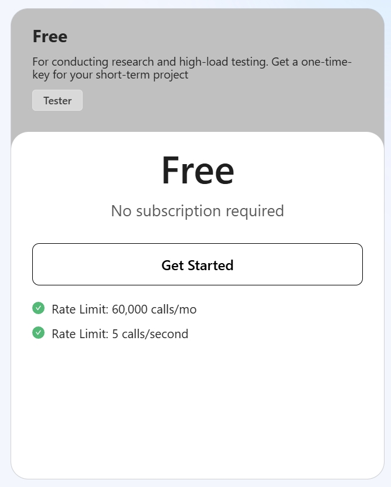
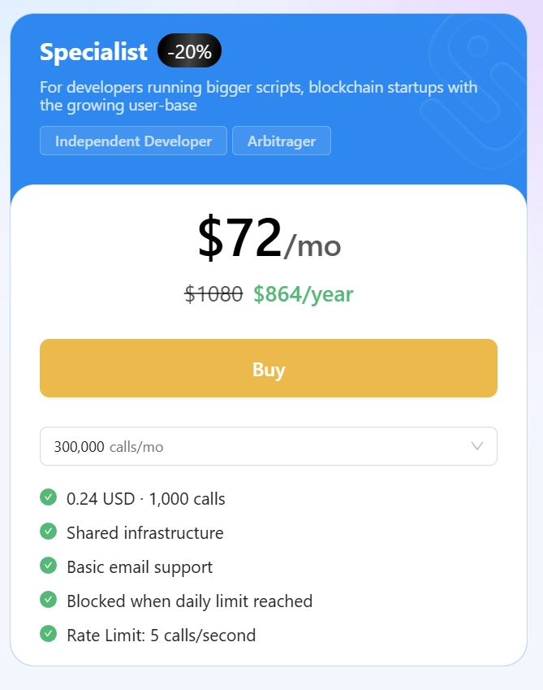
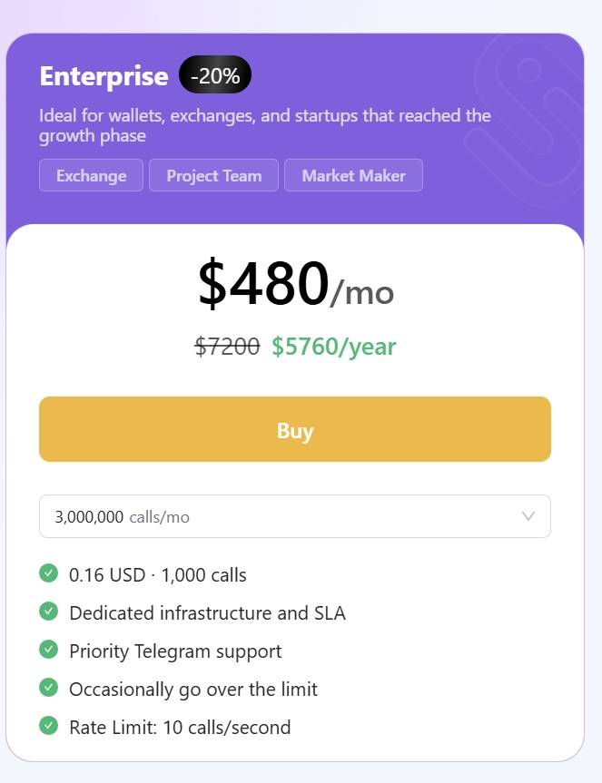
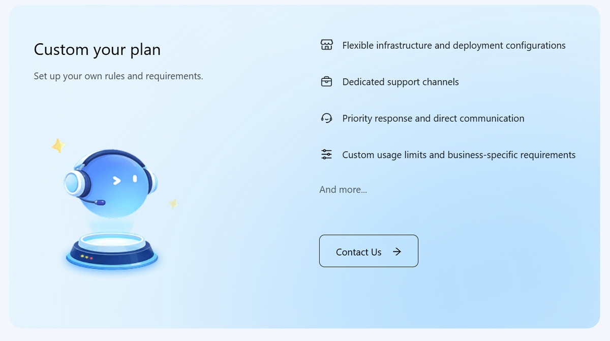
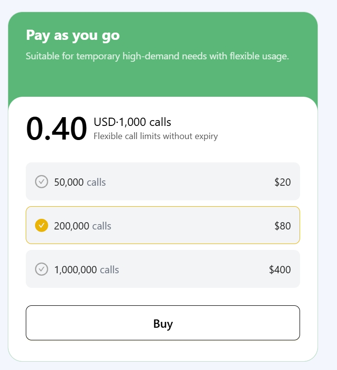

# Plans

UniSat API can still be accessed without an API key. However, to ensure fair allocation of resources, we recommend including an API key in all requests. Requests made without a key, or with a free key, may face strict rate limits or even no response under high load.

To provide everyone with convenient and diverse options for purchasing API keys, we offer several plans: Free, Specialist, Enterprise, Custom, and Pay as you go.

For details, visit: [unisat.io/plans](https://unisat.io/plans)

Enjoy 20% off when you choose an annual Specialist or Enterprise plan.

## Free

Ideal for conducting research and high-load testing. Obtain a one-time key for your short-term project.

- Rate limit: 60,000 calls/month
- Rate limit: 5 calls/second

## Specialist

Suitable for developers running larger scripts and blockchain startups with a growing user base.

## Enterprise

Perfect for wallets, exchanges, and startups in their growth phase.

## Custom

To inquire about a custom API plan, please feel free to contact us at contact@unisat.io.

## Pay As You Go

Suitable for temporary high-demand needs with flexible usage.

