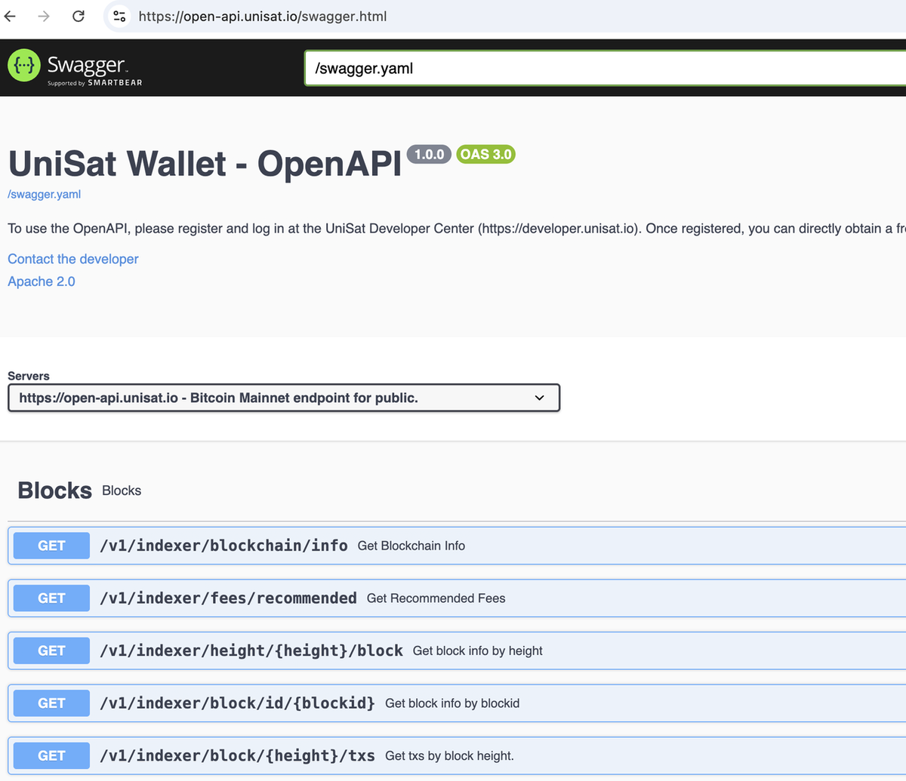

# UniSat Open API

UniSat Open APIs provide standardized RESTful interfaces and an online interactive Swagger UI for quick exploration and testing: [https://open-api.unisat.io](https://open-api.unisat.io)

### Available API Documentation

Full API documentation: [https://github.com/unisat-wallet/unisat-dev-docs](https://github.com/unisat-wallet/unisat-dev-docs)

Recommended Reading: [BTC Assets and Other Protocol Assets Overview](https://github.com/unisat-wallet/unisat-dev-docs/blob/master/open-api/btc-and-protocol-assets.md)

#### Blockchain Indexing API

| API Category | Description | Documentation Link |
| --- | --- | --- |
| Blockchain Level | Core blockchain and transaction indexing | [blockchain-indexer.md](https://github.com/unisat-wallet/unisat-dev-docs/blob/master/open-api/auto-generated/docs/blockchain-indexer.md) |
| Inscription Level | Indexing of inscriptions | [inscription-indexer.md](https://github.com/unisat-wallet/unisat-dev-docs/blob/master/open-api/auto-generated/docs/inscription-indexer.md) |
| brc20 | Indexing and data for BRC20 tokens | [brc20-indexer.md](https://github.com/unisat-wallet/unisat-dev-docs/blob/master/open-api/auto-generated/docs/brc20-indexer.md) |
| Runes | Indexing for Runes tokens | [runes-indexer.md](https://github.com/unisat-wallet/unisat-dev-docs/blob/master/open-api/auto-generated/docs/runes-indexer.md) |
| Alkanes | Developer-friendly API built on Alkanes indexer | [alkanes-indexer.md](https://github.com/unisat-wallet/unisat-dev-docs/blob/master/open-api/auto-generated/docs/alkanes-indexer.md) |
| Collection | NFT collections indexing | [collection-indexer.md](https://github.com/unisat-wallet/unisat-dev-docs/blob/master/open-api/auto-generated/docs/collection-indexer.md) |
| Fractal | Fractal network related APIs | [fractal.md](https://github.com/unisat-wallet/unisat-dev-docs/blob/master/open-api/auto-generated/docs/fractal.md) |

#### UniSat Services API

| API Category | Description | Documentation Link |
| --- | --- | --- |
| UniSat Inscribe | Inscription creation and management | [inscribe.md](https://github.com/unisat-wallet/unisat-dev-docs/blob/master/open-api/auto-generated/docs/inscribe.md) |
| brc20 Marketplace | BRC20 marketplace | [brc20-marketplace.md](https://github.com/unisat-wallet/unisat-dev-docs/blob/master/open-api/auto-generated/docs/brc20-marketplace.md) |
| Runes Marketplace | Runes marketplace | [runes-marketplace.md](https://github.com/unisat-wallet/unisat-dev-docs/blob/master/open-api/auto-generated/docs/runes-marketplace.md) |
| Alkanes Marketplace | Alkanes marketplace | [alkanes-marketplace.md](https://github.com/unisat-wallet/unisat-dev-docs/blob/master/open-api/auto-generated/docs/alkanes-marketplace.md) |
| Collection Marketplace | Ordinals Collection marketplace | [collection-marketplace.md](https://github.com/unisat-wallet/unisat-dev-docs/blob/master/open-api/auto-generated/docs/collection-marketplace.md) |
| Domain Marketplace | Ordinals Domain marketplace | [domain-marketplace.md](https://github.com/unisat-wallet/unisat-dev-docs/blob/master/open-api/auto-generated/docs/domain-marketplace.md) |
| brc20 Swap | Swap functionality for BRC20 tokens | [brc20-swap.md](https://github.com/unisat-wallet/unisat-dev-docs/blob/master/open-api/auto-generated/docs/brc20-swap.md) |
| CAT20 DEX | Decentralized exchange for CAT20 tokens | [cat20-dex.md](https://github.com/unisat-wallet/unisat-dev-docs/blob/master/open-api/auto-generated/docs/cat20-dex.md) |

---

### Apply for a UniSat API Key

Before you start using UniSat API, you need to apply for a UniSat API Key.

We offer several plans: Free, Specialist, Enterprise, Custom, and Pay-as-you-go. Visit [https://developer.unisat.io/](https://developer.unisat.io/) and follow the on-page instructions to apply.

How to Acquire a UniSat API Key: [https://docs.unisat.io/dev-center/developer-center/how-to-acquire-a-unisat-api-key](https://docs.unisat.io/dev-center/developer-center/how-to-acquire-a-unisat-api-key)

Note: UniSat API can still be accessed without an API key. However, to ensure fair allocation of resources, we recommend including an API key in all requests. Requests made without a key, or with a free key, may face strict rate limits or even no response under high load.

---

### Usage

1. Use the Swagger UI [https://open-api.unisat.io](https://open-api.unisat.io) and read the documents [https://github.com/unisat-wallet/unisat-dev-docs](https://github.com/unisat-wallet/unisat-dev-docs) to test API calls.

2. Register at [https://developer.unisat.io/](https://developer.unisat.io/) and authenticate as required by each API.

3. Handle error codes and messages according to the [error codes documentation](https://github.com/unisat-wallet/unisat-dev-docs/blob/master/errors/README.md)

---

For any questions, support, or discussions, please reach out to us on Discord: [http://discord.gg/unisat](http://discord.gg/unisat) Thank you for using UniSat Open API!
